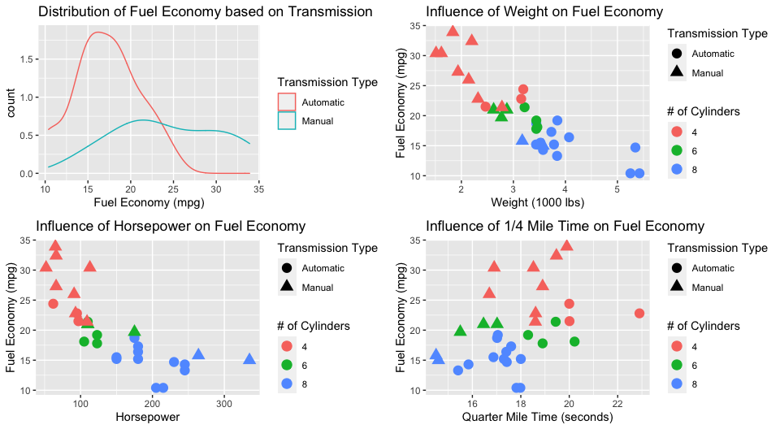
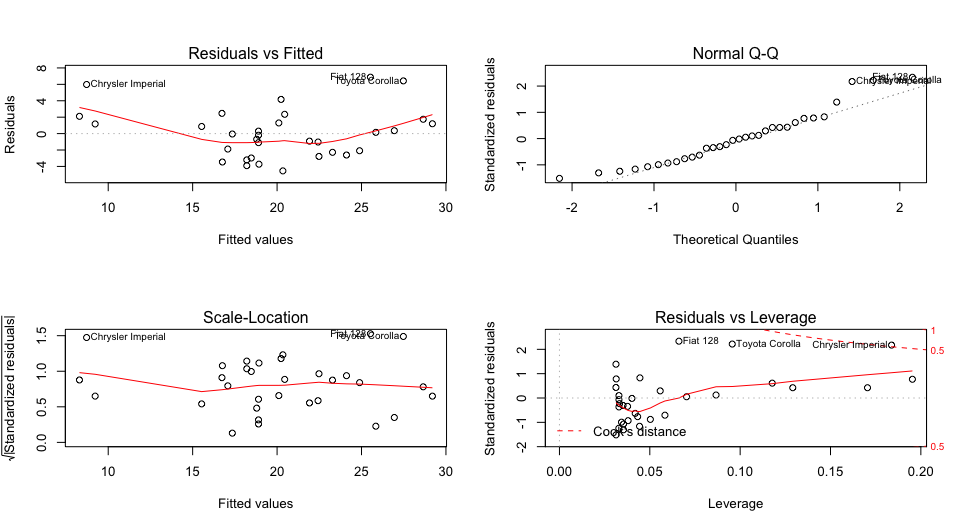

Project
================
J.E. Panzik
6/4/2020

## Executive Summary

The analysis below shows that many of the variables are related to each
other and the inclusion of all variables reduces the statistical
significance of the fit. The best fit of the variables’ impact on fuel
economy using a linear model shows that the vehicle weight, quarter mile
time, and transmission type have the most significant impact on fuel
economy.

``` r
library(datasets)
data <- mtcars
table(is.na(data))
```

    ## 
    ## FALSE 
    ##   352

``` r
head(data, 3)
```

    ##                mpg cyl disp  hp drat    wt  qsec vs am gear carb
    ## Mazda RX4     21.0   6  160 110 3.90 2.620 16.46  0  1    4    4
    ## Mazda RX4 Wag 21.0   6  160 110 3.90 2.875 17.02  0  1    4    4
    ## Datsun 710    22.8   4  108  93 3.85 2.320 18.61  1  1    4    1

``` r
library(ggplot2); library(gridExtra)
data$am <- as.factor(data$am)

p1 <- ggplot(data, aes(x=mpg, color=am)) +
      geom_density(aes(y = ..count..)) +
      xlab("Fuel Economy (mpg)") +
      ggtitle("Distribution of Fuel Economy based on Transmission") +
      scale_color_discrete(name = "Transmission Type", labels=c("Automatic", "Manual") )

p2 <- ggplot(data, aes(x=wt, y=mpg, color=as.factor(cyl), shape=am)) +
      geom_point(size=4) +
      xlab("Weight (1000 lbs)") +
      ylab("Fuel Economy (mpg)") + 
      ggtitle("Influence of Weight on Fuel Economy") +
      scale_color_discrete(name = "# of Cylinders" ) +
      scale_shape_discrete("Transmission Type", labels=c("Automatic", "Manual"))

p3 <- ggplot(data, aes(x=hp, y=mpg, color=as.factor(cyl), shape=am)) +
      geom_point(size=4)+
      xlab("Horsepower") +
      ylab("Fuel Economy (mpg)") + 
      ggtitle("Influence of Horsepower on Fuel Economy") +
      scale_color_discrete(name = "# of Cylinders" ) +
      scale_shape_discrete("Transmission Type", labels=c("Automatic", "Manual"))

p4 <- ggplot(data, aes(x=qsec, y=mpg, color=as.factor(cyl), shape=am)) +
      geom_point(size=4) +
      xlab("Quarter Mile Time (seconds)") +
      ylab("Fuel Economy (mpg)") + 
      ggtitle("Influence of 1/4 Mile Time on Fuel Economy") +
      scale_color_discrete(name = "# of Cylinders" ) +
      scale_shape_discrete("Transmission Type", labels=c("Automatic", "Manual"))

grid.arrange(p1, p2, p3, p4, nrow=2)
```

<!-- -->

``` r
fitAll <- lm(mpg ~., data=data)
summary(fitAll)
```

    ## 
    ## Call:
    ## lm(formula = mpg ~ ., data = data)
    ## 
    ## Residuals:
    ##     Min      1Q  Median      3Q     Max 
    ## -3.4506 -1.6044 -0.1196  1.2193  4.6271 
    ## 
    ## Coefficients:
    ##             Estimate Std. Error t value Pr(>|t|)  
    ## (Intercept) 12.30337   18.71788   0.657   0.5181  
    ## cyl         -0.11144    1.04502  -0.107   0.9161  
    ## disp         0.01334    0.01786   0.747   0.4635  
    ## hp          -0.02148    0.02177  -0.987   0.3350  
    ## drat         0.78711    1.63537   0.481   0.6353  
    ## wt          -3.71530    1.89441  -1.961   0.0633 .
    ## qsec         0.82104    0.73084   1.123   0.2739  
    ## vs           0.31776    2.10451   0.151   0.8814  
    ## am1          2.52023    2.05665   1.225   0.2340  
    ## gear         0.65541    1.49326   0.439   0.6652  
    ## carb        -0.19942    0.82875  -0.241   0.8122  
    ## ---
    ## Signif. codes:  0 '***' 0.001 '**' 0.01 '*' 0.05 '.' 0.1 ' ' 1
    ## 
    ## Residual standard error: 2.65 on 21 degrees of freedom
    ## Multiple R-squared:  0.869,  Adjusted R-squared:  0.8066 
    ## F-statistic: 13.93 on 10 and 21 DF,  p-value: 3.793e-07

``` r
fitOpt <- step(fitAll, direction="both", trace=FALSE)
summary(fitOpt)
```

    ## 
    ## Call:
    ## lm(formula = mpg ~ wt + qsec + am, data = data)
    ## 
    ## Residuals:
    ##     Min      1Q  Median      3Q     Max 
    ## -3.4811 -1.5555 -0.7257  1.4110  4.6610 
    ## 
    ## Coefficients:
    ##             Estimate Std. Error t value Pr(>|t|)    
    ## (Intercept)   9.6178     6.9596   1.382 0.177915    
    ## wt           -3.9165     0.7112  -5.507 6.95e-06 ***
    ## qsec          1.2259     0.2887   4.247 0.000216 ***
    ## am1           2.9358     1.4109   2.081 0.046716 *  
    ## ---
    ## Signif. codes:  0 '***' 0.001 '**' 0.01 '*' 0.05 '.' 0.1 ' ' 1
    ## 
    ## Residual standard error: 2.459 on 28 degrees of freedom
    ## Multiple R-squared:  0.8497, Adjusted R-squared:  0.8336 
    ## F-statistic: 52.75 on 3 and 28 DF,  p-value: 1.21e-11

``` r
fit1 <- lm(mpg ~wt, data=data)
fit2 <- lm(mpg ~wt + am, data=data)

summary(fit1)[4]
```

    ## $coefficients
    ##              Estimate Std. Error   t value     Pr(>|t|)
    ## (Intercept) 37.285126   1.877627 19.857575 8.241799e-19
    ## wt          -5.344472   0.559101 -9.559044 1.293959e-10

``` r
summary(fit2)[4]
```

    ## $coefficients
    ##                Estimate Std. Error     t value     Pr(>|t|)
    ## (Intercept) 37.32155131  3.0546385 12.21799285 5.843477e-13
    ## wt          -5.35281145  0.7882438 -6.79080719 1.867415e-07
    ## am1         -0.02361522  1.5456453 -0.01527855 9.879146e-01

``` r
anova(fit1, fit2)
```

    ## Analysis of Variance Table
    ## 
    ## Model 1: mpg ~ wt
    ## Model 2: mpg ~ wt + am
    ##   Res.Df    RSS Df Sum of Sq     F Pr(>F)
    ## 1     30 278.32                          
    ## 2     29 278.32  1 0.0022403 2e-04 0.9879

``` r
par(mfrow = c(2, 2))
plot(fit1)
```

<!-- -->
